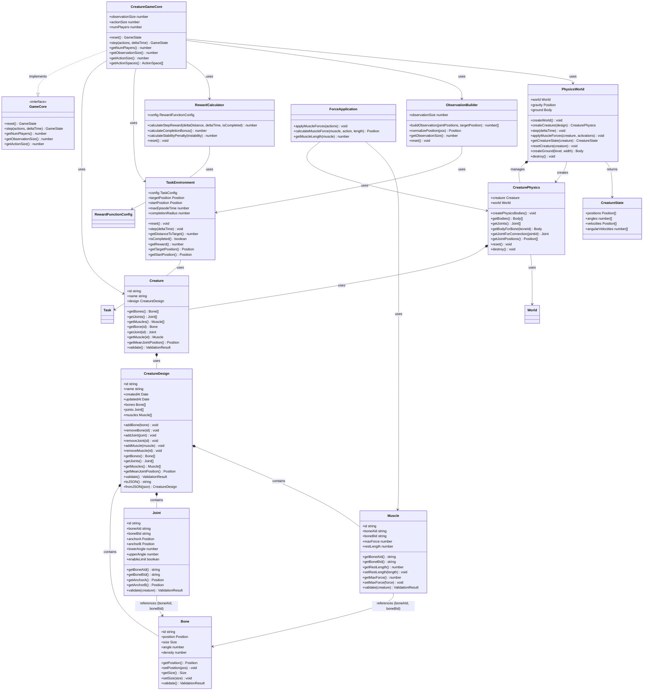

# Core Class Diagram: Base Game - CritteRL

**Date**: 2025-01-27  
**Feature**: Base Game Implementation - Core Classes Only

This document contains a simplified Mermaid class diagram showing only the core, most important classes for the game logic and physics simulation.

## Core Classes Overview

This simplified diagram focuses on the essential classes that form the core game loop and physics simulation:

### Game Layer
- **CreatureGameCore**: Implements MimicRL's GameCore interface, orchestrates the game loop
- **Creature**: Represents a creature entity with its structure
- **TaskEnvironment**: Manages task state, completion, and rewards
- **RewardCalculator**: Computes rewards based on performance
- **ObservationBuilder**: Constructs observation vectors for RL

### Physics Layer
- **PhysicsWorld**: Manages the physics simulation world
- **CreaturePhysics**: Creates and manages physics bodies for creatures
- **ForceApplication**: Applies muscle forces based on RL actions

### Data Models
- **CreatureDesign**: Complete creature structure definition
- **Bone**: Individual bone component
- **Joint**: Connection between two bones
- **Muscle**: Actuator connecting two bones
- **CreatureState**: Current physics state snapshot

### Key Relationships

1. **CreatureGameCore** orchestrates everything:
   - Uses `Creature` for creature structure
   - Uses `TaskEnvironment` for task management
   - Uses `RewardCalculator` for reward computation
   - Uses `ObservationBuilder` for RL observations
   - Uses `PhysicsWorld` for physics simulation

2. **CreatureDesign** is the blueprint:
   - Contains collections of `Bone`, `Joint`, and `Muscle`
   - `Joint` and `Muscle` reference `Bone` via IDs

3. **PhysicsWorld** manages simulation:
   - Creates `CreaturePhysics` instances from `CreatureDesign`
   - `CreaturePhysics` manages physics bodies and joints
   - `ForceApplication` applies muscle forces to physics bodies

### Excluded Classes

This simplified diagram excludes:
- **Services**: CreatureService, StorageService, TrainingService, TaskService, PhysicsService
- **UI Components**: All React components (CreatureEditor, TrainingView, etc.)
- **Rendering**: CanvasRenderer, CreatureRenderer, EnvironmentRenderer
- **Training Models**: TrainedModel, TrainingSession
- **Utilities**: ValidationResult, StorageUsage, TaskResult, GameConstants
- **Adapters**: PlanckAdapter (implementation detail)

These classes are important for the full application but not essential for understanding the core game loop and physics simulation.

